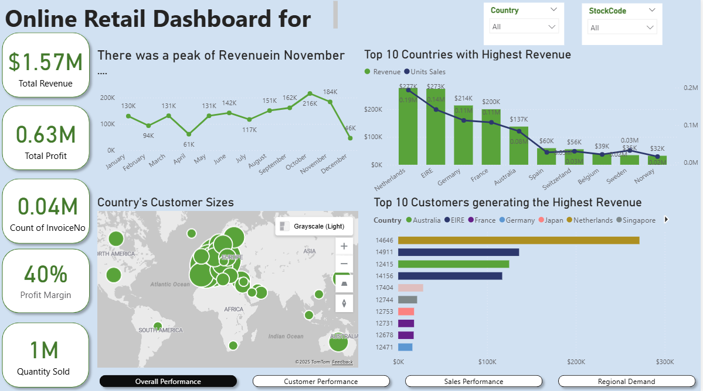
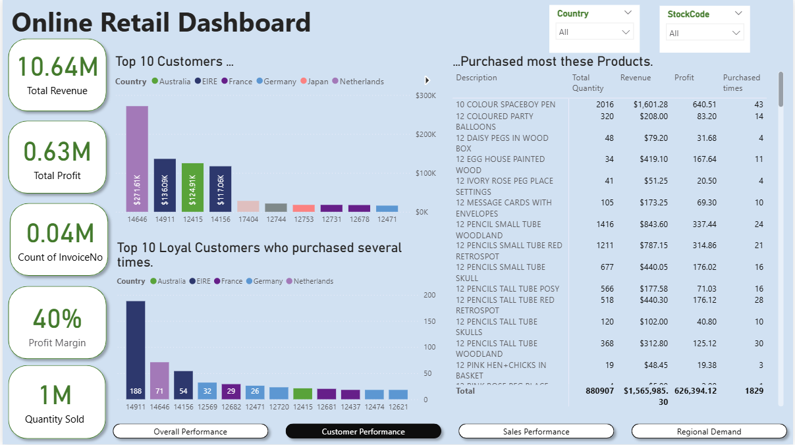
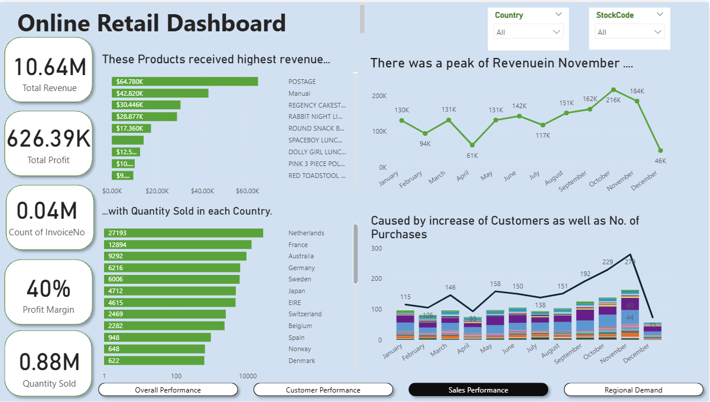
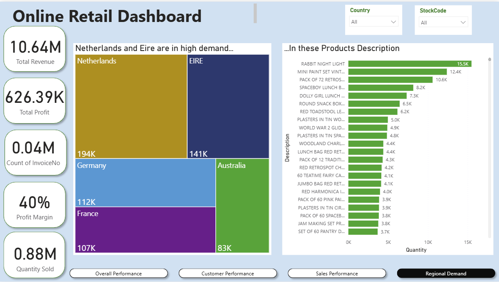

# Online Retail Sales Analytics Dashboard (Power BI)

## 📊 Project Overview
This project presents a comprehensive **Online Retail Sales Analytics Dashboard** built in **Power BI**, designed to analyze **revenue, profit, customer behavior, and product demand** across multiple countries.

The dashboard enables stakeholders to identify **seasonal trends, high-value customers, top-performing products, and high-demand regions** to support data-driven business decisions.

---

## 🛠 Tools & Technologies
- **Power BI**
- **Power Query**
- **DAX**
- **Excel**

---

## 🧠 Skills Demonstrated
- Data cleaning & transformation  
- Star-schema data modeling  
- KPI design and DAX measures  
- Time-series analysis  
- Customer segmentation  
- Geographic & regional demand analysis  
- Interactive dashboard design  

---

## 📈 Key KPIs
- **Total Revenue:** $10.64M  
- **Total Profit:** $0.63M  
- **Profit Margin:** 40%  
- **Quantity Sold:** ~1M units  
- **Number of Invoices:** ~40K  

---

## 🏗 Data Model
- Designed a **star schema** consisting of:
  - **Fact table:** Sales transactions
  - **Dimension tables:** Customers, Products, Countries, Date  
- This structure improved:
  - Report performance
  - Relationship clarity
  - DAX calculation accuracy

---

## 🔄 Data Preparation
- Cleaned and transformed **500K+ rows** of raw sales data using **Power Query**
- Key steps included:
  - Removing negative quantities and invalid unit prices
  - Handling duplicate invoices
  - Standardizing customer and product attributes
  - Creating a proper date table for time intelligence

---

## 📊 Dashboard Pages & Insights

### 1️⃣ Overall Performance
- High-level business KPIs
- Monthly revenue trends
- Clear seasonality with a **strong peak in November**

---

### 2️⃣ Customer Performance
- Top 10 customers by revenue
- Loyal and repeat customer analysis
- Supports targeted retention strategies

---

### 3️⃣ Sales Performance
- Product-level revenue, profit, and purchase frequency
- Identification of top-performing SKUs such as:
  - **DOTCOM POSTAGE**
  - **PAPER CRAFT**

---

### 4️⃣ Regional Demand
- Geographic visualization of customer demand
- Country-level revenue and quantity analysis
- **Netherlands and EIRE** identified as high-opportunity markets

---

## 💡 Key Insights
- November shows the **highest revenue**, driven by holiday-season demand
- A small group of customers contributes a significant share of total revenue
- Certain products consistently outperform others, indicating strong demand
- European markets, particularly **Netherlands and EIRE**, show strong expansion potential

---

## 📦 Business Impact
This dashboard helps businesses:
- Optimize sales and marketing strategies
- Focus on high-value customers and products
- Improve inventory planning
- Make informed regional expansion decisions

---

## 📁 How to Use
1. Download the Power BI file
2. Open it in **Power BI Desktop**
3. Use slicers for **Country** and **Product**
4. Navigate between pages for focused insights

---

## 🔗 Portfolio Note
This project is designed as a **portfolio-ready Power BI case study**, demonstrating **end-to-end analytics skills** from raw data preparation to executive-level insights.

